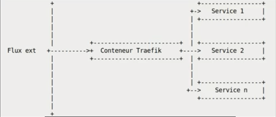

# Traefik Dockerized

[Tuto create dev env with Docker and Traefik](https://medium.com/@fredericleaux/tuto-monter-un-environnement-de-dev-docker-avec-traefik-et-oauth2-pr%C3%AAt-pour-le-micro-service-12f78874d79c)
Basic container for a dev environment under Docker with Traefik, MariaDb, Redis, Maildev, Thumbor and Keycloak


- [Traefik Dockerized](#traefik-dockerized)
  - [Overview](#overview)
  - [Requirements](#requirements)
  - [Installation](#installation)
    - [Traefik Dashboard](#traefik-dashboard)
    - [Entry Points](#entry-points)
    - [Docker Network](#docker-network)
    - [Let's Encrypt](#lets-encrypt)
    - [acme.json](#acmejson)
    - [Dashboard Routing](#dashboard-routing)
  - [Usage](#usage)
    - [Update Traefik](#update-traefik)
  - [Resources](#resources)

---

## Overview

This repository contains a template to deploy [Traefik 2](https://containo.us/traefik/) using [Docker Compose](https://docs.docker.com/compose/) on a single machine running [Docker](https://www.docker.com/).

## Requirements

- [Docker](https://www.docker.com/)
- [Docker Compose](https://docs.docker.com/compose/)
- [Git](https://git-scm.com/)

## Installation

update your hosts:
- osx: `nano /etc/hosts`
- Linux (Debian based): `vim /etc/hosts`

and add : `127.0.0.1       local.services.fr, local.first-service.fr, local.second-service.fr, local.thumbor.fr, local.maildev.fr, traefik.lh, local.minio.fr`

Clone the repository and run :

```sh
$ docker-compose up -d
```

## Local interfaces access

- [Traefik interface](http://traefik.lh)
- [MailDev interface](http://local.maildev.fr)
- [Keycloak interface](http://local.services.fr)

Redis
```sh
$ docker-compose exec redis bash
$ redis-cli
```

MariaDb is in localhost:3317 with root:root

## Advance Configuration

### Traefik Dashboard

To disable the _Traefik_ Dashboard, change the following configuration value to `false`:

```yaml
api:
  dashboard: false
```

### Entry Points

Per default, this Traefik deployment listens on port `80` (HTTP) and `443` (HTTPS). This can be changed by adapting the `address` field of the Entry Points:

```yaml
entryPoints:
  http:
    address: ":80"
  https:
    address: ":443"
```

### Docker Network

To let _Traefik_ auto-discover the applications running as a Docker container on the machine, create a Docker network and add it to the configuration. In this example, the Docker network is called `proxy`.

1. Create a Docker network (not necessary):

```sh
$ docker network create traefik
```

1. Add the network to the configuration:

```yaml
providers:
  docker:
    network: traefik
```

### Let's Encrypt

To use the built-in Let's Encrypt support, add a Certificate Resolver to the configuration:

```yaml
certificatesResolvers:
  letsencrypt:
    acme:
      email: admin@example.com
      storage: acme.json
      httpChallenge:
        entryPoint: http
```

### acme.json

The file `acme.json` will be mounted inside the _Traefik_ container and is used to store the certificates received from Let's Encrypt. Create this file and change the file permissions to `600`:

```sh
$ touch letsencrypt/acme.json
$ chmod 600 letsencrypt/acme.json
```

### Dashboard Routing

If the _Traefik_ Dashboard is enabled, configure the router in the `docker-compose.override.yml` file to make the dashboard available:

```yaml
labels:
  - traefik.http.routers.traefik-http.rule=Host(`traefik.example.com`)
  - traefik.http.routers.traefik-http.entrypoints=http
  - traefik.http.routers.traefik-http.middlewares=redirect
  - traefik.http.routers.traefik-https.rule=Host(`traefik.example.com`)
  - traefik.http.routers.traefik-https.entrypoints=https
  - traefik.http.routers.traefik-https.tls=true
  - traefik.http.routers.traefik-http.service=api@internal
  - traefik.http.routers.traefik-https.service=api@internal
  - traefik.http.middlewares.redirect.redirectscheme.scheme=https
```

## Usage

Once the configuration is completed, download the Docker images and start the services using docker-compose:

```sh
$ docker-compose pull
$ docker-compose up -d
```

To stop the deployment, you can either run the `stop` or `down` command of docker-compose:

```sh
$ docker-compose stop
Stopping traefik_traefik_1 ... done
$ docker-compose down
Stopping traefik_traefik_1 ... done
Removing traefik_traefik_1 ... done
```

By using `docker-compose down` instead of `docker-compose stop`, the containers will be also removed.

### Update Traefik

To update the _Traefik_ instance, download the latest Docker images and recreate the services:

```sh
$ docker-compose pull
Pulling traefik ... done
$ docker-compose up -d
Recreating traefik_traefik_1 ... done
```

The command `docker-compose pull` will automatically fetch and download the latest version of _Traefik_ available on Docker Hub. Finally, the command `docker-compose up -d` will recreate the running _Traefik_ container with the latest version.

## Docker container exemple configuration
Bellow an exemple docker-compose.yml for docker connected with Traefik

```yaml
version: "3.7"

services:
  fpm:
    build: # Info to build the Docker image
      context: ./docker # Specify where the Dockerfile is located (e.g. in the root directory of the project)
      dockerfile: Dockerfile-php # Specify the name of the Dockerfile
    volumes:
      - ./:/var/www/project/:cached # Location of the project for php-fpm. Note this should be the same for NGINX.*
    networks:
      - internal # Docker containers (services) that need to connect to each other should be on the same network.
  nginx:
    build:
      context: ./docker
      dockerfile: Dockerfile-nginx
    networks:
      - internal
      - proxy
    labels:
      # Traefik configuration, Hostname needs to be changed
      - traefik.http.routers.UNIQ_CONTAINER_NAME.rule=Host(`local.MYSITE.fr`)
      - traefik.http.routers.UNIQ_CONTAINER_NAME.entrypoints=http
      #- traefik.http.routers.UNIQ_CONTAINER_NAME.middlewares=redirect
      #- traefik.http.routers.UNIQ_CONTAINER_NAME-https.rule=Host(`example.com`)
      #- traefik.http.routers.UNIQ_CONTAINER_NAME-https.entrypoints=https
      #- traefik.http.routers.UNIQ_CONTAINER_NAME-https.tls=true
      #- traefik.http.routers.UNIQ_CONTAINER_NAME-https.tls.certresolver=letsencrypt
      - traefik.http.services.UNIQ_CONTAINER_NAME.loadbalancer.server.port=80
      #- traefik.http.middlewares.redirect.redirectscheme.scheme=https

networks:
  proxy: # the external network declared in Traefik docker-compose 
    external: true
  internal:
    external: false

```

## MinIO
S3-compliant Object Storage. Allows you to locally simulate an S3 compatible ObjectStorage server

- First login in minIO console http://127.0.0.1:9001 (log / pass in docker-compose.yml)
- Create Access key and buckets

```sh
# run this command in  minIo container. This target mc to nimIO
mc config host add dockerized-minio-1 http://127.0.0.1:9002 [key] [secret]

# set public access to bucket files 
mc anonymous set public dockerized-minio-1/[Bucket name]/

# check 
mc anonymous get dockerized-minio-1/[Bucket name]/
```

You can access files with http://local.minio.fr/[Bucket name]/[file name]


## Resources

- [Traefik](https://containo.us/traefik/)
- [Traefik Documentation](https://docs.traefik.io/)
- [Docker](https://www.docker.com/)
- [Docker Compose](https://docs.docker.com/compose/)
- [Mail dev](https://github.com/maildev/maildev)
- [Thumbor](https://github.com/thumbor/thumbor)